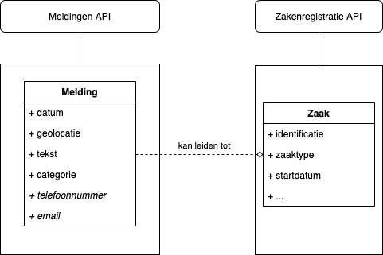

# De relatie tussen Signalen en zaakgericht werken (ZGW)

Zaakgericht werken is een concept dat veel gebruikt wordt in gemeenten, maar kent in de praktijk veel vormen en implementatievarianten. VNG werkt met [GEMMA](https://www.gemmaonline.nl/index.php/ZGW_in_GEMMA_2) aan het richtinggeven en standaardiseren van Zaakgericht werken, onder andere door het opstellen van [API specificaties](https://vng-realisatie.github.io/gemma-zaken/).

Signalen is een systeem voor het melden en afhandelen van meldingen openbare ruimte (MOR) dat inwoners in staat stelt om eenvoudig en anoniem meldingen te doen. Signalen volgt de [informatiearchitectuur](https://appstore.commonground.nl/20190130_-_Common_Ground_-_Informatiearchitectuurprincipes.pdf)- en [realisatieprincipes](https://appstore.commonground.nl/20190130_-_Common_Ground_-_Realisatieprincipes.pdf) van Common Ground waarbij onder andere verantwoordelijkheden worden gescheiden in lagen en componenten. Signalen biedt bijvoorbeeld een service die een API aanbiedt. Deze API wordt bijvoorbeeld gebruikt door de Signalen frontend, maar ook door verschillende andere externe systemen.

Gemeente Amsterdam heeft Signalen gekoppeld aan verschillende taakafhandelsystemen voor onder andere handhaving en beheer van verlichting. Meldingen worden bij binnenkomst door een behandelend medewerker beoordeeld en - afhankelijk van de categorie - eventueel doorgestuurd naar een gespecialiseerd taakafhandelsysteem. Meldingen die doorgezet zijn worden vervolgens afgehandeld in het gespecialiseerde taakafhandelsysteem.

Sinds begin 2020 is de software van Signalen geschikt gemaakt voor andere gemeenten. Ook gemeenten die zaakgericht werken uitgebreid hebben ingebed in hun organisatie tonen interesse in de functionaliteit van Signalen en willen de oplossing in combinatie met zaakgericht werken gebruiken. In dit document gaan we in op de verhouding tussen Signalen en Zaakgericht werken (ZGW) en hoe deze twee gecombineerd kunnen worden.

## Het verschil tussen een Melding en een Zaak

In [Zaakgericht Werken in het Gemeentelijk Gegevenslandschap](https://www.gemmaonline.nl/images/gemmaonline/f/fa/20190206_-_Zaakgericht_werken_in_het_Gemeentelijk_Gegevenslandschap.pdf) (4.1) wordt er onderscheid gemaakt tussen een Melding en een Zaak.

- Melding: een binnenkomende mededeling (kennisgeving) over een gebeurtenis, geconstateerde waarneming of een geconstateerd feit. 
- Zaak: een samenhangende hoeveelheid werk met een gedefinieerde aanleiding en een gedefinieerd resultaat waarvan kwaliteit en doorlooptijd bewaakt moeten worden.

Een melding wordt dus normaal gedaan door een extern persoon (bijvoorbeeld een inwoner) en kan - afhankelijk van de aard van de melding - leiden tot een zaak wanneer de melding verdere behandeling behoeft. Wanneer een melding geen verdere behandeling behoeft kan ook besloten worden geen zaak aan te make of de zaak voortijdig af te sluiten.

Hierbij is het belangrijk om te vermelden dat één melding kan leiden tot meerdere zaken, maar ook dat meerdere meldingen kunnen leiden tot één zaak. Bijvoorbeeld meerdere meldingen over één kapotte straatlantaarn kunnen met één zaak afgehandeld worden. Er is dus geen strikte één-op-één relatie.

Voor Meldingen en Zaken zijn er verschillende registraties onderkend. Er wordt een register voorzien voor meldingen, waarbij melding-specifieke gegevens in het Meldingenregister worden bijgehouden.

## Een casus met Signalen en Openzaak

Als we het ontwerp van VNG voor Zaakgericht werken toepassen op een specifieke implementatie met Signalen en Openzaak zien we hoe de twee samen kunnen werken.

1. Een inwoner doet een melding via de Signalen frontend.
1. Een medewerker beoordeelt de binnengekomen melding in de Signalen backoffice en handelt meldingen direct in de backoffice af waar geen behandeling voor nodig is.
1. Voor een melding die niet direct afgehandeld kan worden worden één of meerdere zaken aangemaakt in Openzaak onder het gewenste zaaktype.
1. Een medewerker met een (gespecialiseerde) taakapplicatie handelt vervolgens de zaak af via Openzaak.
1. De status van de afgehandelde zaak wordt automatisch via een notificatie teruggekoppeld aan Signalen. Op het moment dat alle onderliggende zaken in Openzaak zijn afgehandeld wordt een Melding in Signalen automatisch gesloten en kan de melder een notificatie per e-mail hierover ontvangen.

## Referenties

- [Marcel Moerman - Zaak Document Services](https://github.com/MarcelMoerman/Zaak-Document-Services)
- [API's voor zaakgericht werken
](https://vng-realisatie.github.io/gemma-zaken/)
- [Zaakgericht Werken in het Gemeentelijk Gegevenslandschap](https://www.gemmaonline.nl/images/gemmaonline/f/fa/20190206_-_Zaakgericht_werken_in_het_Gemeentelijk_Gegevenslandschap.pdf)
