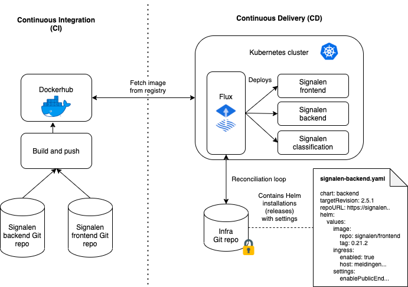

# Architectuur voor ontwikkeling en beheer (CI/CD) Signalen

Signalen wordt [open source ontwikkeld op Github](https://github.com/Signalen). Op deze plek werken de softwareontwikkelaars samen, wordt iedere versie van de software automatisch getest en worden resultaten van de tests teruggekoppeld aan de ontwikkelaars.

Ontwikkelaars kunnen via Github wijzigingen aan de code van Signalen voorstellen door middel van een pull request. Na goedkeuring van een van de Signalen teamleden wordt een wijziging doorgevoerd in een nieuwe versie van Signalen.

Via Github worden ook nieuwe versies van de software gepubliceerd. Voor elke nieuwe versie wordt geautomatiseerd vanaf Github een [Docker image](https://hub.docker.com/u/signalen) op Dockerhub gepubliceerd met een bijbehorende [Helm chart](https://github.com/signalen/helm-charts) zodat gemeenten eenvoudig de Signalen software kunnen gebruiken in hun eigen omgeving. In de eigen omgeving van de gemeente wordt ook de gemeente-specifieke configuratie zoals het logo en de gemeentenaam toegevoegd.

Doordat nieuwe versies van de software iedere keer op Dockerhub gepubliceerd worden, kunnen gemeenten eenvoudig nieuwe versies van de software installeren.

## Haven

Signalen sluit goed aan op [Haven](https://haven.commonground.nl/), een kandidaat-standaard van VNG voor cloud-agnostische infrastructuur. De Haven standaard schrijft een specifieke inrichting van [Kubernetes](https://kubernetes.io/) voor en zorgt daarmee voor een generieke basis zodat centraal ontwikkelde applicaties zoals Signalen zonder problemen kunnen draaien op gemeente-specifieke omgevingen.

Gemeenten die aan de slag gaan met Signalen richten hun omgeving vaak in volgens deze Haven standaard, zodat ze zeker weten dat applicaties die centraal ontwikkeld zijn goed blijven werken.

## Geautomatiseerd uitrollen van de software voor één gemeente

In de bovenstaande afbeelding is de hele architectuur te zien. Links zie je de Git repository voor de backend en frontend op Github en de automatische publicatie naar Dockerhub. Ook wel het Continuous Integration (CI) gedeelte genoemd. Alles aan de linkerkant gebeurt maximaal één keer.

Aan de rechterkant van de afbeelding staat het Continous Delivery (CD) gedeelte, dit is een eigen omgeving voor iedere gemeente. Voor de meeste Signalen gemeenten bestaat dat uit de volgende bouwblokken:

- Een Kubernetes cluster, ingericht volgens de Haven standaard.
- Een configuratierepository in Git waarin de specifieke instellingen voor een gemeente bewaard worden (bijv. versie, logo, gemeentenaam).
- De GitOps tool [Flux](https://fluxcd.io/) of [Argo CD](https://argoproj.github.io/argo-cd/) waarmee de instellingen geautomatiseerd toegepast worden op het cluster.

Om een configuratiewijziging door te voeren of om een nieuwe versie van Signalen te installeren maakt de systeembeheerder een wijziging aan in een van de configuratiebestanden in de repository. Na goedkeuring wordt deze wijzing automatisch doorgevoerd. De GitOps tool pakt deze wijzing vervolgens automatisch op en voert de gevraagde wijzingen door op het Kubernetes cluster.

## Additionele tools

Verder worden door verschillende Signalen gemeenten de volgende tools gebruikt voor het monitoren van de applicatie:

- [Loki](https://grafana.com/oss/loki/) voor opslaan van de containerlogs.
- [Prometheus](https://prometheus.io/) voor het opslaan van metrics.
- [Linkerd](https://linkerd.io/) voor bijhouden van kritische prestatieindicatoren (KPI's) van de applicatie voor systeembeheerders zoals het aantal succesvolle verzoeken en het aantal gefaalde verzoeken.
- [Grafana](https://grafana.com/oss/grafana/) voor het visueel tonen van de informatie uit Loki en Prometheus voor ontwikkelaars en systeembeheerders.
